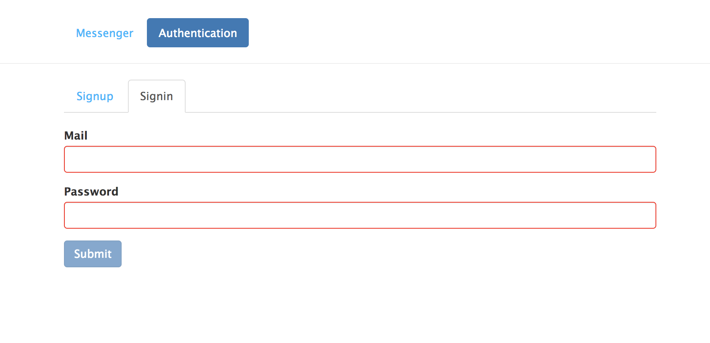

# Angular2 Message Board

This is an online message board application based on MEAN stack. The demo of this project can be found [here](https://angular2-message-board.herokuapp.com/).

## Signup Page

## Signin Page

## Message Board Page

